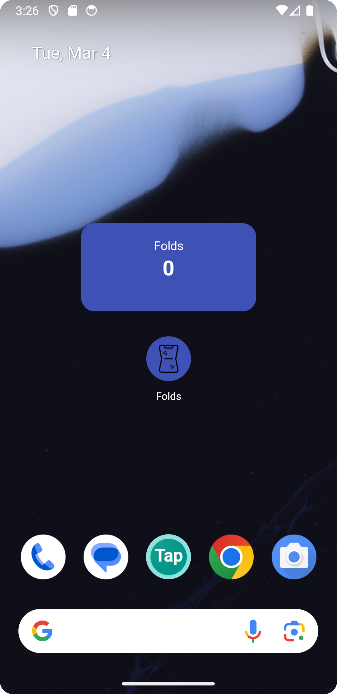

# Folds
Folds is an Android app that tracks the number of times a foldable phone is opened or closed. 
It features a home screen widget that displays the fold count and ensures continuous tracking, 
even after a device restart. Built with Kotlin, and optimized for 
foldable devices with hinge sensor.

The reasons are obvious to do a count: Maintenance and Durability.
Some brands specify an estimated number of folds before potential mechanical issues arise (e.g., 200,000 folds).

